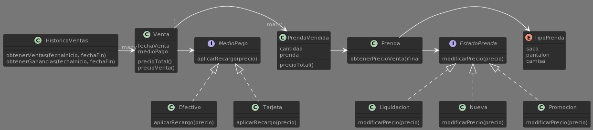

# macowins
## Requerimientos:
- Obtener el precio de venta de una prenda, que varía en función de su estado.
- Una prenda puede tener estados *Nueva, Liquidación, Promoción*.
- Una prenda nueva no modifica el precio.
- Una prenda en promoción le resta un valor fijado por el usuario.
- Una prenda en liquidación le resta un 50% del valor de la prenda.
- Conocer el tipo de prenda.
- Registrar las ventas realizadas.
- Obtener las ganancias de un día dado.
- Modificar el precio de la venta en función del medio de pago utilizado.
## Diagrama de Clases



## Pruebas
```
mvn install
mvn test
```
